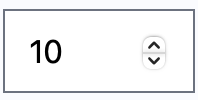
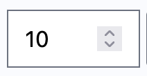
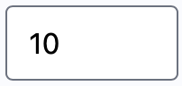

# jcaillot/tailwind-plugin-type-number-reset

A Tailwind plugin for removing input[type=number] increment arrows

## Installation

Install the plugin from npm:

```shell
npm install -D tailwind-plugin-type-number-reset
```
or
```shell
yarn add -D tailwind-plugin-type-number-reset
```

Then add the plugin to your tailwind.config.js file:

```JavaScript

// tailwind.config.js
module.exports = {
  theme: {
    // ...
  },
  plugins: [
    require('tailwind-plugin-type-number-reset'),
    // ...
  ],
}

```

## Examples

Standard input type number with increment arrows:

Safari:



Firefox:



**After**, using _type-number-reset_ plugin:



## Basic usage

```HTML

<input type="number"
       min="0"
       class="
          w-24 
          rounded 
          type-number-reset"
       value="10"/>
```

Note: the field is still an input type number. The keyboard up and down arrows
still increment the input value.

## Accessibility concern

Mozilla has an opinion about the removal of those _spinbuttons_:

> If spinbutton is not an important feature for your form control, consider not using type="number". Instead, use inputmode="numeric" along with a pattern attribute that limits the characters to numbers and associated characters.


https://developer.mozilla.org/en-US/docs/Web/HTML/Element/input/number#accessibility

## How to run test

```shell
jest --coverage
```

## Licence

This project is licensed under the [MIT License](./LICENSE).

## Authors

- [@jcaillot](http://chaman.ca)

